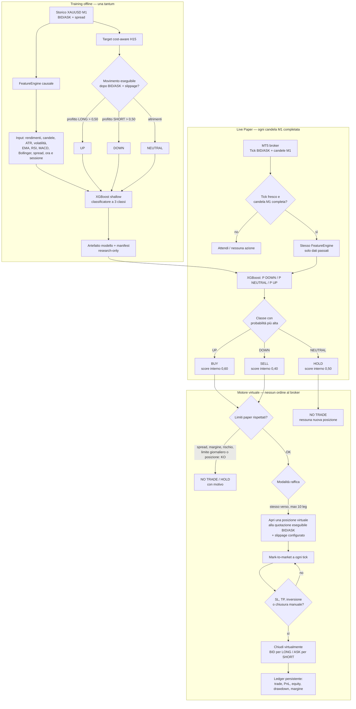

# Flowchart — modello cost-aware nel Live Paper

Questo documento descrive il modello attualmente selezionato nel Live Paper:
**XGBoost cost-aware H15 — research**. È un esperimento virtuale: non invia
mai ordini al broker e non è stato promosso a una strategia reale.

## Cosa entra nel modello

Il modello non vede il futuro né “guarda” il grafico come una persona. Riceve
solo valori numerici calcolati dalle candele M1 già chiuse: variazioni di prezzo,
forma delle candele, volatilità, trend/medie, RSI/MACD, posizione nelle Bande di
Bollinger, spread e momento della giornata/sessione.

## Cosa produce davvero

Ad ogni candela M1 completa, XGBoost restituisce tre probabilità:

- `P(DOWN)`: ritiene più probabile un movimento SHORT eseguibile a 15 minuti;
- `P(NEUTRAL)`: non vede un movimento sufficiente dopo costi;
- `P(UP)`: ritiene più probabile un movimento LONG eseguibile a 15 minuti.

La classe più alta diventa `SELL`, `HOLD` o `BUY`. Per compatibilità con il
motore paper già esistente, la classe viene convertita internamente in uno score
0,40 / 0,50 / 0,60: **non è una probabilità binaria e non va letta come “60% di
probabilità di salire”**.

## Guardrail e risultati possibili

Anche quando il modello dice BUY o SELL, il motore può non entrare se lo spread
supera il limite, non c’è margine virtuale, è stato raggiunto il limite giornaliero
o ci sono già dieci posizioni concordi. In raffica può aprire al massimo una nuova
posizione per candela M1 completata.

Ogni posizione paper usa BID/ASK del broker, slippage e SL/TP. I risultati sono
solo virtuali e vengono salvati localmente: trade chiusi, PnL realizzato/aperto,
equity, margine e drawdown. Nessuna parte del flusso contiene API o codice di
invio ordini a MT5 o Trading212.
